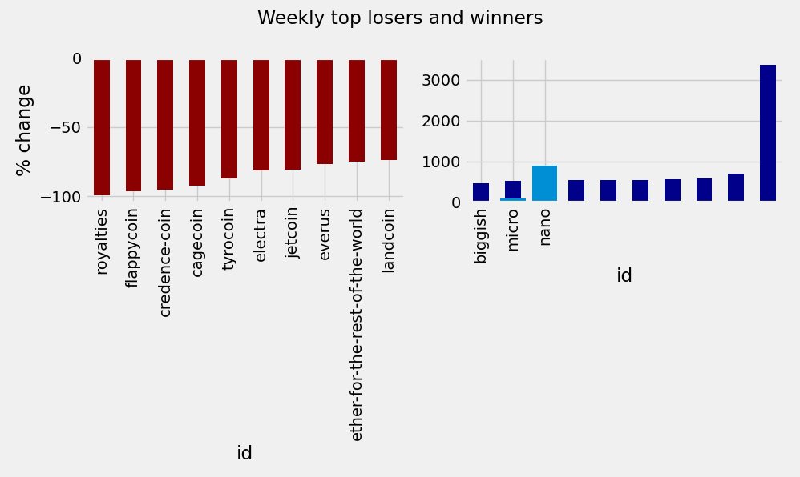

## Analysis of Cryptocurrency Trends, using Pycharm's Scientific Mode

#### Explore daily and weekly stats to discover the biggest winners and losers in crypto as well as most capitalized cryptocurrencies of all time!

Based on the data found [here](https://www.kaggle.com/archit9406/crptocurrency-trends) on Kaggle, based on a project taught by [Datacamp](https://learn.datacamp.com/)

(This dataset is outdated and no longer updated, and is to be used for practice)

